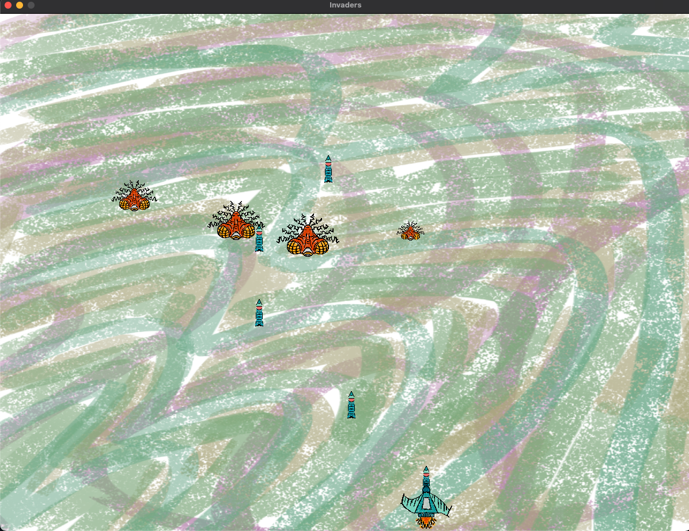

# Invaders

<!---Esses são exemplos. Veja https://shields.io para outras pessoas ou para personalizar este conjunto de escudos. Você pode querer incluir dependências, status do projeto e informações de licença aqui--->




> Desenvolvimento de um jogo baseado no Invaders Clássico, utilizando-se a biblioteca gráfica Raylib.

### Ajustes e melhorias

O projeto ainda está em desenvolvimento e as próximas atualizações serão voltadas nas seguintes tarefas:

- [ ] Diagrama de objetos do jogo
- [ ] Testes de unidade
- [ ] Implementação do objeto bullet
- [ ] Funções de colisão e destruição de objetos
- [ ] Refatorar as classes de comportamento
- [ ] Adicionar opção de jogo em FULL SCREEN
- [ ] Implementar classe Fleet para refatorar Game::_build_objects()

## 💻 Pré-requisitos

Antes de começar, verifique se você atendeu aos seguintes requisitos:
* Compilador `g++`, para Windowns é recomendado o `mingw32`
* O jogo é compatível com versões recentes de `<Windows / Linux / MacOS>`


## 🚀 Instalando e rodando o Invaders

Para instalar o Invaders, siga estas etapas:

Clonagem do Repositório:
```
    git clone https://github.com/pds2/20231-team-11.git
```

Linux e macOS:
```
    make
```

Windows:
```
    mingw32-make
```

## 📖 User Stories

### Game

Como jogador, quero um Game baseado em Galaxian que crie todos os objetos do jogo, incluindo uma nave controlada pelo jogador e inimigos para interagir.

### Alien

Como jogador, quero que um Alien que se movimente, com uma pontuação diferente para cada tipo de alien, proporcionando interações únicas com base em seu comportamento e textura.

### Ship

Como jogador, quero um Ship que eu posso controlar, permitindo-me navegar e interagir com o jogo.

### Boss

Como jogador, quero um alien especial chamado Boss que tenha uma barra de vida e não possa ser morto com um único tiro, proporcionando uma experiência de jogo mais desafiadora e estratégica. Ele deve ter seu próprio comportamento e textura distintiva.

### MotionObject

Como jogador, quero um MotionObject que esteja relacionado a todos os objetos em movimento do jogo, permitindo-me definir sua velocidade, aceleração e posição com precisão.

### Behaviour

Como jogador, quero um Behaviour que possa modificar a velocidade, aceleração e/ou posição de um objeto, permitindo comportamentos e movimentos personalizados para os MotionObjects.

### Bullet

Como jogador, quero que uma Bullet seja um MotionObject que se relacione com outros objetos em movimento, com o objetivo de causar dano ou destruí-los.

### Fleet

Como jogador, quero uma Fleet que seja um vetor de aliens, permitindo definir a quantidade de aliens que aparecem na tela para interação durante o jogo.

### Texture

Como jogador, quero que uma Texture defina as imagens de todos os objetos do jogo, facilitando a identificação visual dos elementos do jogo.


## 🤝 Colaboradores

<table>
  <tr>
    <td align="center">
      <a href="#">
        <sub>
          <b><a href="https://github.com/joao-jcc">João Costa</a></b>
        </sub>
      </a>
    </td>
    <td align="center">
      <a href="#">
        <sub>
          <b><a href="https://github.com/luccaamp">Lucca Alvarenga</a></b>
        </sub>
      </a>
    </td>
    <td align="center">
      <a href="#">
        <sub>
          <b><a href="https://github.com/lucaspedras8">Lucas Pedras</a></b>
        </sub>
      </a>
    </td>
     <td align="center">
      <a href="#">
        <sub>
          <b><a href="https://github.com/LrcSantos">Lucas Santos</a></b>
        </sub>
      </a>
    </td>
     <td align="center">
      <a href="#">
        <sub>
          <b><a href="https://github.com/Fissicaro">Arthur Fissicaro</a></b>
        </sub>
      </a>
    </td>
  </tr>
</table>

